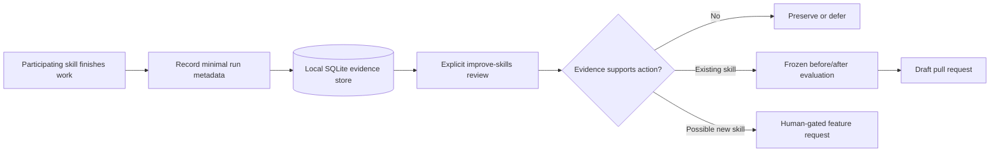

# Improve Skills

`improve-skills` is an evidence-driven maintenance loop for reusable Codex
skills. It records small, privacy-conscious observations from real skill runs,
groups recurring problems, and evaluates focused improvements without allowing
an observation to rewrite a skill automatically.

The goal is not constant change. **“No change needed” is a successful result.**

## The short version

The system separates observation from action:



Ordinary skill runs only contribute evidence. Changes happen later, during an
explicit review, after deduplication, ownership checks, and controlled
evaluation. Existing-skill changes can end in a draft pull request; proposed
new skills can end only in a feature request. Nothing is merged automatically.

## Why `SKILL.md` is small

The 42-line [`SKILL.md`](SKILL.md) is the skill's runtime entry point, not its
entire implementation. Keeping it compact reduces the instructions loaded into
the model when the skill runs.

The feature uses progressive disclosure:

- [`SKILL.md`](SKILL.md) contains the purpose, routing, core workflow, and
  non-negotiable guardrails.
- [`references/`](references/) contains detailed guidance that is loaded only
  for the relevant part of a review.
- [`scripts/feedback_store.py`](scripts/feedback_store.py) enforces storage,
  privacy, lifecycle, clustering, and evaluation invariants deterministically.
- [`tests/test_feedback_store.py`](tests/test_feedback_store.py) verifies those
  invariants and failure boundaries.

The long design specification therefore became a small control file backed by
focused documentation, executable enforcement, and tests.

## How observation works

Participating skills contain a short post-run footer. After substantive work,
the skill makes one best-effort call to the shared recorder:

```text
python improve-skills/scripts/feedback_store.py record-run \
  --skill-path <participating-skill-directory> \
  --invocation-mode explicit \
  --outcome success \
  --context-path <current-repository> \
  --non-blocking
```

Every substantive run may record minimal metadata. Detailed observations are
reserved for reusable evidence such as:

- an explicit user correction;
- a failed test or violated acceptance criterion;
- a missing or ambiguous reusable instruction;
- a recurring workaround or environment problem;
- overlap between skills;
- a guardrail that materially prevented harm or rework;
- a recurring workflow that may lack an owner.

Routine success does not need a detailed observation. Recording is
non-blocking: if the database is unavailable, the user's primary task still
succeeds.

The complete participation contract is in
[`references/observation-protocol.md`](references/observation-protocol.md).

### Reliability boundary

A participating skill can report what happened after it ran. It cannot detect
an occasion when it should have activated but never did. Activation misses need
external routing benchmarks, explicit user feedback, or another durable source.
Execution evidence and activation evidence are deliberately kept separate.

## What is stored

The standard-library Python helper writes to a local SQLite database, normally:

```text
Windows: %USERPROFILE%\.agents\skill-feedback\skill-feedback.db
POSIX:   ~/.agents/skill-feedback/skill-feedback.db
```

The database is outside the skills repository and is not committed to Git.
`CODEX_SKILL_FEEDBACK_DB` can select another stable user-level location.

The recorder stores facts such as:

- a UUID for the run and each observation;
- skill name, Git commit, dirty state, and content/bundle hashes;
- invocation mode, outcome, timestamps, and generalized evidence type;
- severity, reuse judgment, confidence tier, and lifecycle history;
- privacy-preserving hashes for skill paths and repository contexts.

It rejects raw prompts and transcripts, common secrets, credentials, email
addresses, private URLs, unnecessary personal paths, and unrecognized
observation fields. SQLite transactions, foreign keys, WAL mode, bounded retry,
and versioned migrations protect consistency under concurrent use.

This validation is a safety net, not permission to submit sensitive material.
Observations must be generalized before the recorder is called.

## How an explicit review works

`improve-skills` is configured for explicit invocation. A typical request is:

```text
$improve-skills review recent skill performance
```

During a review, Codex:

1. Reads the applicable repository instructions and relevant skill references.
2. Checks Git and authoritative GitHub state without disturbing unrelated work.
3. Inventories installed skills, versions, issues, and pull requests so an
   existing owner is not overlooked.
4. Runs database health checks and targeted evidence queries.
5. Groups observations by underlying problem, target, skill version, and
   independent run rather than treating every row as a separate occurrence.
6. Weighs user corrections, objective failures, recurrence, context, recency,
   severity, obsolete versions, and positive counter-evidence.
7. Classifies the result as an existing-skill issue, repository rule, shared
   infrastructure, possible new skill, insufficient evidence, or no action.

The analysis rules are documented in
[`references/evidence-and-analysis.md`](references/evidence-and-analysis.md).

## Improving an existing skill

An existing skill is changed only through a controlled before/after experiment:

1. Select one evidence cluster and one target skill.
2. Freeze the acceptance criteria, holdouts, target version, and baseline before
   editing.
3. Make one focused change.
4. Rerun the identical evaluation.
5. Run regression and holdout checks, including protection for useful existing
   guardrails.
6. Compare correctness, activation boundaries, regressions, usefulness, and
   instruction cost.
7. Keep the change only when the evidence shows a measured net improvement.

OpenAI `plugin-eval` is the preferred optional evaluation backend. If it is not
available, deterministic local checks may support a recommendation, but the
result is explicitly degraded and cannot be marked promotable. A promotable
change may be committed, pushed, and opened as a **draft pull request**. It is
never merged automatically.

The evaluation and publication gates are defined in
[`references/evaluation-and-publishing.md`](references/evaluation-and-publishing.md).

## Identifying a possible new skill

A repeated task does not automatically justify a new skill. A candidate normally
needs at least three independent occurrences, or two unusually costly or risky
ones. It must also have a recognizable recurring goal, stable inputs and
outputs, useful validation, realistic trigger boundaries, and no natural
existing owner.

After searching existing skills, clusters, issues, and pull requests, the review
may create or update a human-gated GitHub feature request. It does **not** create
the proposed skill, label it ready for implementation, or open an implementation
pull request.

## Evidence lifecycle

Evidence is retained rather than silently rewritten or deleted. The normal
lifecycle is:

```text
observed → candidate → validating → validated → promotable
         → implemented → monitoring → confirmed
```

Alternative states include `deferred`, `invalid`, `duplicate`, `superseded`,
`regressed`, `reverted`, and `declined`. State transitions append immutable
history, and observations, clusters, and evaluations can be linked to public
issues, pull requests, merge commits, or sanitized outcome identifiers.

## Main helper commands

The recorder and review helper support these operations:

| Command | Purpose |
| --- | --- |
| `record-run` / `record` | Store a completed run and generalized observations |
| `health` | Check database integrity, schema, journal mode, and path durability |
| `query` / `history` | Inspect targeted evidence and lifecycle history |
| `cluster` / `clusters` | Group evidence around canonical problems and aliases |
| `mark` | Transition lifecycle state while preserving history |
| `evaluation-begin` | Freeze criteria, holdouts, and the before version |
| `evaluation-record` | Store immutable hashes of baseline and result artifacts |
| `evaluation-decide` | Discard, recommend, or promote an evaluated change |
| `link` | Associate evidence with an issue, PR, merge, or outcome |
| `backfill` | Import one sanitized historical evidence batch exactly once |

Read-only review commands can use the global `--read-only` option. If the
database does not exist, read-only mode reports that condition without creating
or migrating a database.

## What the skill deliberately does not do

`improve-skills` does not:

- run implicitly during ordinary coding;
- store raw conversations or project data;
- interpret one observation as proof of a general problem;
- let a running skill modify itself;
- weaken its own privacy, evidence, evaluation, or approval gates;
- implement a proposed new skill automatically;
- merge pull requests.

Its purpose is conservative learning from real work: preserve what is working,
identify recurring problems, and make only changes that survive an explicit,
repeatable evaluation.

## Design provenance

The methodology adapts concepts from `rebelytics/one-skill-to-rule-them-all`
while replacing its storage and evaluation mechanics with a Codex-specific,
privacy-at-write SQLite design. It also incorporates calibrated use of OpenAI's
optional `plugin-eval` tooling. No upstream implementation or prose is vendored.

Sources, versions, adaptations, rejected approaches, evaluator limitations, and
the upstream failure-class audit are recorded in
[`references/design-provenance.md`](references/design-provenance.md).
